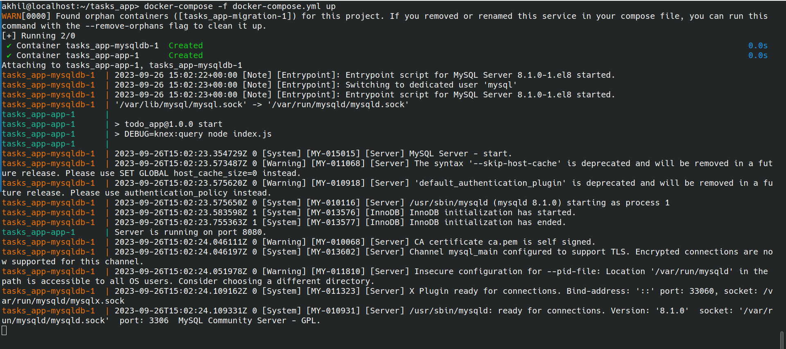
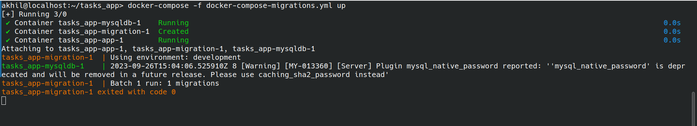
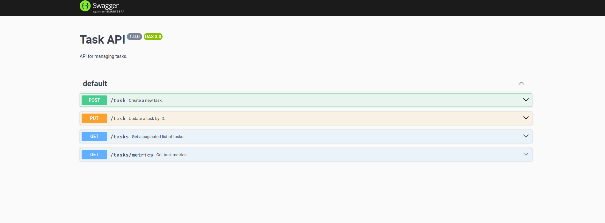
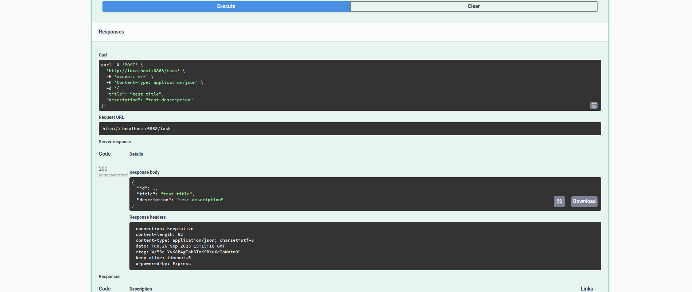
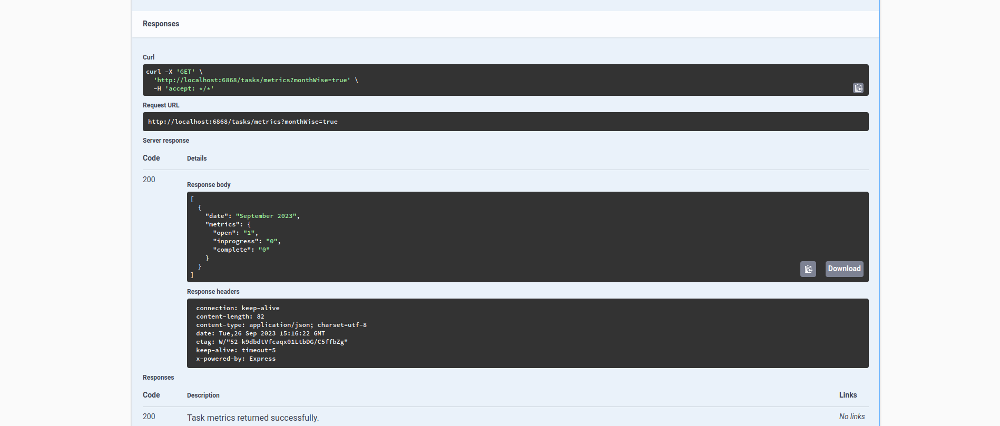

# Task management application

## Setup Instructions

### Prequisite
- Docker
- docker-compose

### Clone repository

```
git clone https://github.com/akhilkpdasan/task-app.git
```
```
git checkout main
```

### Start application and MySQL docker services

```
docker-compose -f docker-compose.yml up
```



### Run DB migration
This  creates the necessary tables for the application to run (only needs to be run once)

```
docker-compose -f docker-compose-migrations.yml up
```

You should be able to see that one migration was run successfuly after which you can close this service by pressing `Ctrl-C`



### Swagger documentation
Once the application is up and running visit `http://localhost:6868/api-docs/` to view Swagger documentation



